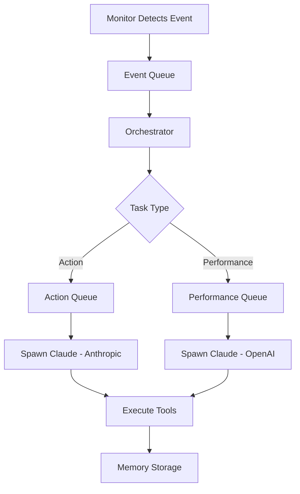

# Multi-Agent System Architecture

## Overview

The Rusty Butter Multi-Agent System is a modular, event-driven architecture that coordinates multiple AI agents (Claude instances) to handle different types of tasks across various platforms (Twitch, Discord, Social Media, etc.).

## Core Components

### 1. Orchestrator (`orchestrator/`)
**Role**: Central coordinator that spawns Claude instances based on events
- **Multi-LLM Support**: Routes different task types to different AI providers (Anthropic, OpenAI, local models)
- **Task Queuing**: Separate queues for action tasks vs performance tasks
- **Event Processing**: Listens to events from monitors and spawns appropriate agents

### 2. Monitors (`monitors/`)
**Role**: Platform-specific event detection and monitoring

#### Event Monitor (`event-monitor/`)
- Core event processing and logging
- Handles system-wide events

#### Social Monitor (`social-monitor/`)
- **Modular Architecture**: Broken into platform-specific modules
- **Platforms**: Twitter, Reddit, Instagram, Facebook, Snapchat
- **Event Detection**: Mentions, keywords, interactions
- **Directory Structure**:
  ```
  social-monitor/src/
  ├── index.ts           # Main MCP server
  ├── types.ts           # Shared interfaces
  ├── monitor.ts         # Core monitoring class
  ├── utils.ts           # Utility functions
  └── platforms/         # Platform-specific modules
      ├── index.ts       # Platform exports
      ├── twitter.ts     # Twitter API integration
      ├── reddit.ts      # Reddit API integration
      └── instagram.ts   # Instagram API integration
  ```

#### Discord Monitor (`discord-monitor/`)
- Discord server monitoring
- Message detection and response triggers
- Voice channel integration

#### Twitch Monitor (`twitch-monitor/`)
- Twitch stream and chat monitoring
- Viewer interaction detection
- Stream event handling

### 3. Tools (`tools/`)
**Role**: Shared MCP (Model Context Protocol) servers providing specialized capabilities

#### Discord Tools (`discord-tools/`)
- Multi-session Discord management
- Voice connection handling
- Channel and server operations
- Audio clip management

#### Playwright SSE (`playwright-sse/`)
- Persistent browser session management
- Server-Sent Events for real-time updates
- Cross-agent browser sharing
- Web automation capabilities

### 4. Shared Components (`shared/`)
**Role**: Common utilities and integrations

#### Memory Integration (`memory-integration.ts`)
- Semantic memory storage and recall
- Monitor state persistence
- Cross-session knowledge retention

#### Configuration (`config/`)
- **TypeScript Config**: Standardized across all projects
  - `base.json`: Common TypeScript settings
  - `app.json`: Application-specific settings
  - `library.json`: Library-specific settings
- **Prettier Config**: Consistent code formatting
- **ESLint Config**: Code quality standards

## Event Flow



## Multi-LLM Architecture

The system supports multiple AI providers for different task types:

- **Anthropic Claude**: Primary for complex reasoning and conversation
- **OpenAI GPT**: Performance-critical tasks and function calling
- **Local Models**: Privacy-sensitive or high-volume operations

Task routing is configurable via the orchestrator's `taskToLLM` mapping.

## Data Flow

1. **Event Detection**: Monitors detect platform events (mentions, messages, interactions)
2. **Event Queuing**: Events are categorized and queued by type
3. **Agent Spawning**: Orchestrator spawns appropriate Claude instances
4. **Tool Execution**: Agents use MCP tools for platform interactions
5. **Memory Storage**: Context and outcomes stored in semantic memory
6. **State Persistence**: Monitor states saved for continuity

## Configuration Management

### Environment Variables
Each component uses environment-specific configuration:
- API keys and tokens
- Platform credentials
- LLM provider settings
- Feature flags

### Shared Configs
- TypeScript configurations extend workspace-wide settings
- Consistent linting and formatting rules
- Standardized build processes

## Module Communication

### MCP (Model Context Protocol)
- Standardized communication between agents and tools
- Server-Sent Events for real-time updates
- JSON-RPC for tool calls

### Event System
- Node.js EventEmitter for internal communication
- Queue-based task distribution
- Async/await for resource management

## Scalability Features

1. **Horizontal Scaling**: Multiple monitor instances
2. **Queue Management**: Separate queues prevent blocking
3. **Resource Sharing**: Persistent browser sessions
4. **Memory Efficiency**: Modular platform loading
5. **Error Isolation**: Independent monitor processes

## Development Guidelines

### Adding New Platforms
1. Create platform module in appropriate monitor
2. Implement `PlatformAPI` interface
3. Add environment configuration
4. Update orchestrator task routing
5. Add comprehensive error handling

### Creating New Tools
1. Use MCP server template
2. Implement SSE for real-time features
3. Add to shared tools directory
4. Update ecosystem configuration
5. Add TypeScript support

### Modularization Principles
- Single Responsibility: Each module has one clear purpose
- Interface Segregation: Clean API contracts
- Dependency Injection: Configurable dependencies
- Error Boundaries: Isolated failure handling
- Consistent Naming: Clear, descriptive identifiers

## Monitoring and Observability

- Structured logging with Winston
- Agent task tracking
- MCP tool performance metrics
- Platform API health monitoring
- Memory usage analytics

## Security Considerations

- Environment variable isolation
- API key rotation support
- Rate limiting on platform APIs
- Input validation and sanitization
- Error message sanitization